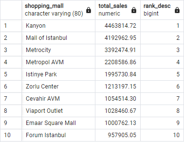
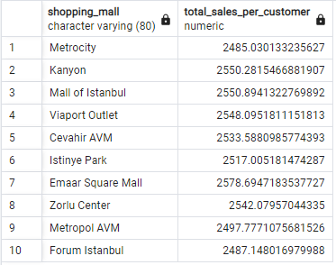
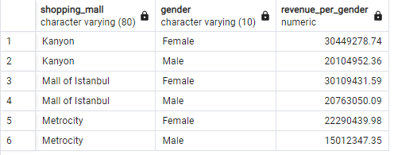
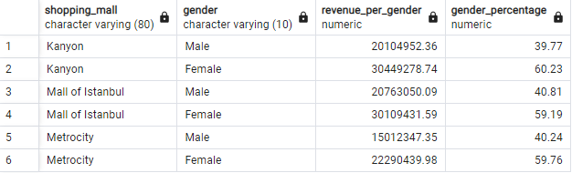
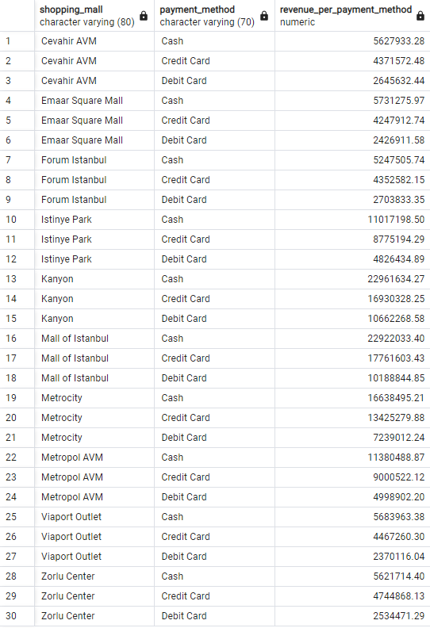
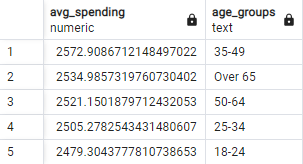
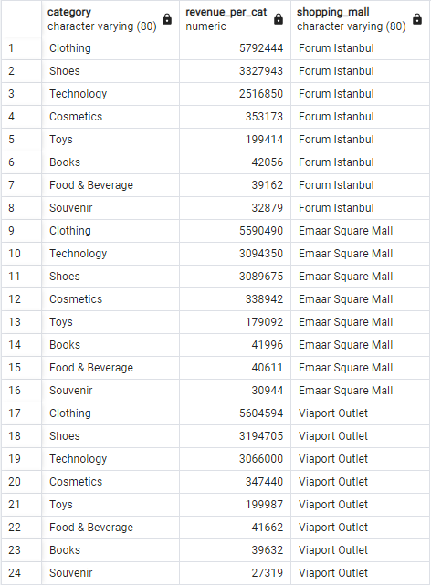
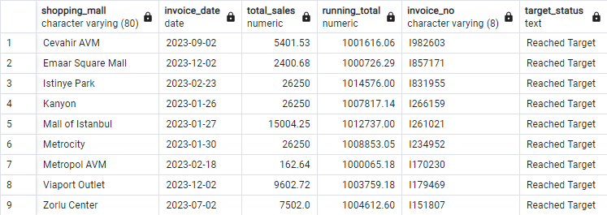

# Introduction

I have used the following dataset from Kaggle to conduct this project:
https://www.kaggle.com/datasets/dataceo/sales-and-customer-data?select=customer_data.csv

After creating the necessary tables in PGAdmin on my local server, I used Excel for data preparation and performed the analysis in PGAdmin. I then used Tableau for data visualization, ensuring a double-check by working with the original dataset rather than the results of my SQL queries.

You can check [here](analysis.sql) the shorter version with my queries.

My Tableau visualisation is publicly available [here](https://public.tableau.com/app/profile/agnes.ujvari/viz/DataAnalystJobListings-PracticeProject/AnalysisofDataAnalystJobListings?publish=yes).

# Preparation

### 1. Creating environment

I created the two necessary tables in PGAdmin with the following columns:

1 )   customer_data  

customer_id VARCHAR(7)  
gender VARCHAR(10)  
Age SMALLINT  
Payment_method VARCHAR(70)  

AND  

2 )   sales_data  

Invoice_no VARCHAR(8)  
customer_id VARCHAR(7)  
category  
quantity SMALLINT  
price DECIMAL   
invoice_date DATE  
shopping_mall VARCHAR(80)  

### 2. Data Preparation

I encountered issues with the invoice_date column format in PGAdmin, which didn’t recognize the original format. I used Excel’s 'text-to-column' feature to separate the date values, then reassembled the date format into YYYY-MM-DD using CONCAT() to ensure correct interpretation in SQL queries, as DATE() function did not worked successfully either.
 
# Analysis

### 1. What was the total sales revenue for each mall in 2023?

```sql
WITH sales_per_mall AS (
    SELECT
        shopping_mall,
        SUM(s.quantity * s.price) AS total_sales
	FROM
        sales_data S
	WHERE
		EXTRACT(YEAR FROM invoice_date) = 2023
    GROUP BY
        shopping_mall)
		
    SELECT
        shopping_mall,
        total_sales,
        RANK() OVER (ORDER BY total_sales DESC) AS rank_desc
    FROM
        sales_per_mall
```



This query uses a Common Table Expression (CTE) to calculate the total sales for each shopping mall by aggregating revenue (SUM(quantity * price)) while narrowing the scope for 2023, grouped by malls. In the main query, a window function (RANK()) ranks the malls based on their total sales in descending order, identifying the top performers.
 
### 2.	What is the average revenue per customer for each mall?

```sql
	SELECT
        s.shopping_mall,
        (SUM(s.quantity * s.price)/COUNT(s.customer_id)) AS
   total_sales_per_customer
    FROM
        sales_data s
    GROUP BY
        shopping_mall
``` 



This suggests a tighter range of spending behavior across customers in most malls, with slight variations in average purchase values.
 

### 3.	What is the total revenue per gender in the top three shopping malls? 

```sql
WITH top_malls AS ( 
    SELECT
        shopping_mall,
        ROUND(SUM(quantity * price)) AS revenue_per_mall
    FROM 
        sales_data
    GROUP BY 
        shopping_mall
    ORDER BY 
        revenue_per_mall DESC
    LIMIT 
        3)

SELECT
    tm.shopping_mall,
    c.gender,
    SUM(s.quantity * s.price) as revenue_per_gender
FROM
    top_malls tm
LEFT JOIN sales_data s on tm.shopping_mall = s.shopping_mall
LEFT JOIN customer_data c on s.customer_id = c.customer_id
GROUP BY
    tm.shopping_mall,
    c.gender
ORDER BY
    tm.shopping_mall,
    revenue_per_gender DESC
``` 

 

 The data shows that in the top 3 malls (Kanyon, Mall of Istanbul, and Metrocity), female customers consistently generate higher revenue than male customers. 
 

### 4.	What is the gender distribution in terms of percentage of total? 

```sql
WITH top_malls AS (
    SELECT
        shopping_mall,
        ROUND(SUM(quantity * price)) AS revenue_per_mall
    FROM 
        sales_data
    GROUP BY 
        shopping_mall
    ORDER BY 
        revenue_per_mall DESC
    LIMIT 
        3)

SELECT
    tm.shopping_mall,
    c.gender,
    SUM(s.quantity * s.price) as revenue_per_gender,
    ROUND(100.0 * SUM(s.quantity * s.price) / SUM(SUM(s.quantity * s.price)) OVER (PARTITION BY tm.shopping_mall), 2) AS gender_percentage
FROM
    top_malls tm
LEFT JOIN sales_data s on tm.shopping_mall = s.shopping_mall
LEFT JOIN customer_data c on s.customer_id = c.customer_id
GROUP BY
    tm.shopping_mall,
    c.gender
ORDER BY
    tm.shopping_mall,
    revenue_per_gender
```

 
 
This query creates a Common Table Expression (CTE), top_malls, to identify the top 3 malls by total revenue (SUM(quantity * price), rounded). It then joins the CTE with the sales_data and customer_data tables using LEFT JOINs, ensuring all top malls are included even without matching data. The query aggregates revenue by gender, showing how each gender contributes to the top malls’ total revenue. The results are ordered by mall and gender revenue in descending order.
 

### 5.	What is the total revenue generated by each shopping mall, grouped by payment method?

```sql 
SELECT
    shopping_mall,
    payment_method,
    SUM(quantity * price) AS revenue_per_payment_method
FROM sales_data s
LEFT JOIN customer_data c ON s.customer_id = c.customer_id
GROUP BY
    shopping_mall,
    payment_method
```

 
 
This query aggregates total revenue (SUM(quantity * price)) by shopping mall and payment method. It uses a LEFT JOIN between the sales_data and customer_data tables to ensure that all sales, regardless of customer information, are included. The data is grouped by shopping_mall and payment_method, providing insights into how each payment method contributes to revenue across malls.

The results show that Cevahir AVM generates the highest revenue for both cash and credit card payments, with Emaar Square Mall also performing well, particularly for cash payments. Malls like Metropol AVM and Zorlu Center show more consistent revenue across payment methods, but at lower overall levels. This indicates that Cevahir AVM sees a higher volume of transactions, and mall-specific preferences for payment methods exist.

### 6.	What is the average spending per age groups? 

```sql
SELECT
    AVG(s.quantity * s.price) AS avg_spending,
    CASE 
        WHEN c.age BETWEEN 0 AND 17 THEN 'Under 18'
        WHEN c.age BETWEEN 18 AND 24 THEN '18-24'
        WHEN c.age BETWEEN 25 AND 34 THEN '25-34'
        WHEN c.age BETWEEN 35 AND 49 THEN '35-49'
        WHEN c.age BETWEEN 50 AND 64 THEN '50-64'
        ELSE 'Over 65'
    END AS age_groups
FROM
    sales_data s
INNER JOIN customer_data c ON s.customer_id = c.customer_id
GROUP BY
    age_groups
ORDER BY
	avg_spending DESC
```
 
This query calculates the average spending per customer by multiplying quantity * price for each transaction and averaging it across all records. It segments customers into six age groups using a CASE statement and groups the data by these age ranges. The results are ordered by avg_spending in descending order, providing insights into which age group spends the most. This analysis helps understand demographic spending patterns.

 

### 7.	What are the differences among the three bottom shopping malls in terms of categories?

```sql
WITH mall_rev_category AS 
    (SELECT
        shopping_mall,
        category,
        ROUND(SUM(quantity * price)) AS revenue_per_cat
    FROM 
        sales_data
    GROUP BY 
        shopping_mall, 
        category
    ORDER BY 
        shopping_mall),
    
ranked_malls AS (
    SELECT
        shopping_mall,
        SUM(revenue_per_cat) AS total_mall_revenue,
        RANK() OVER (ORDER BY SUM(revenue_per_cat) ASC) AS rank_asc
    FROM mall_rev_category
    GROUP BY shopping_mall)

SELECT 
    rc.category,
    rc.revenue_per_cat,
    rc.shopping_mall
FROM 
    mall_rev_category rc 
LEFT JOIN ranked_malls rm ON rc.shopping_mall = rm.shopping_mall
WHERE
    rm.rank_asc <= 3
ORDER BY 
    rm.rank_asc, 
    rc.revenue_per_cat DESC;
```
 
 
This query first calculates the revenue per category for each shopping mall by summing the total revenue (quantity * price) for each combination of shopping_mall and category, ordered by shopping mall. The ranked_malls CTE then computes the total revenue for each mall and ranks them in ascending order of total revenue, focusing on the top 3 malls. The main query retrieves the categories, their revenue, and associated malls for these top 3, ordered by mall rank and category revenue in descending order.

Key Insights:

- Clothing is the top-performing category across all three malls, making it a major revenue driver.
- Technology and Shoes also show strong performance, indicating substantial customer spending.
- Food & Beverage, Souvenir, and Books contribute less, suggesting these categories are secondary in terms of customer preference.
 

### 8.	Imaginery scenario
#### Assuming these malls are owned by the same company with a year target , which malls reached this target and in what order? 

```sql
WITH running_total AS (
    SELECT 
        shopping_mall,
        invoice_date,
        s.quantity * s.price AS total_sales,
        SUM(s.quantity * s.price) OVER (PARTITION BY shopping_mall ORDER BY invoice_date, invoice_no) AS running_total,
        invoice_no
    FROM
        sales_data s
    WHERE
        EXTRACT(YEAR FROM invoice_date) = 2023 -- Filter for the year early
),
previous_running_total AS (
    SELECT 
        shopping_mall,
        invoice_date,
        total_sales,
        running_total,
        invoice_no,
        LAG(running_total) OVER (PARTITION BY shopping_mall ORDER BY invoice_date, invoice_no) AS prev_running_total
    FROM
        running_total
)
SELECT
    shopping_mall,
    invoice_date,
    total_sales,
    running_total,
    invoice_no,
    CASE 
        WHEN running_total >= 1000000
        THEN 'Reached Target'
        ELSE 'Not Reached'
    END AS target_status
FROM 
    previous_running_total
WHERE
    running_total >= 1000000
    AND (prev_running_total < 1000000 OR prev_running_total IS NULL) 
ORDER BY
    shopping_mall, invoice_date;
```


 This query calculates a running total of sales for each shopping mall over time, with the running_total CTE computing the cumulative sales (SUM(quantity * price)) ordered by invoice date and number for each mall. The previous_running_total CTE then uses the LAG() window function to get the previous value of the running total for comparison. In the main query, it identifies when the running total reaches or exceeds 1,000,000 and labels those instances as "Reached Target". It then filters to only show rows where the running total crosses the 1,000,000 threshold, ensuring that only the first occurrence in each mall is included.


 


